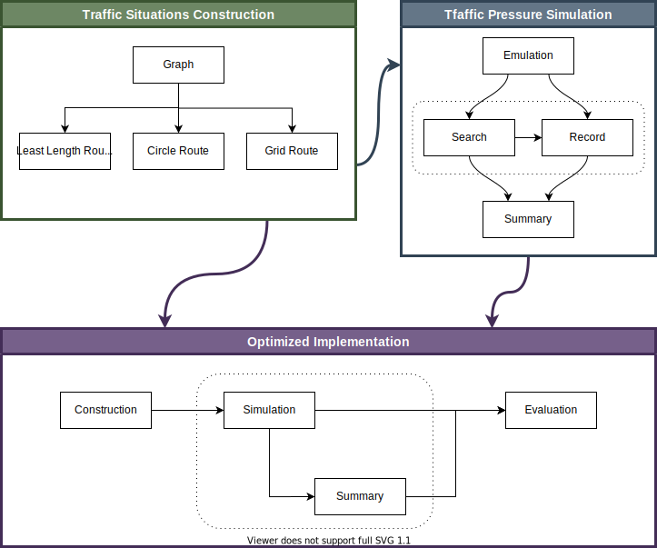

# Traffic Analysis

The project will **construct** the Traffic Situations.

And several Analysis will be performed to **simulate** the traffic pressure under different conditions.

Last but not least, the **optimized** implementation of traffic situation will thus be proposed.

---
- [Traffic Analysis](#traffic-analysis)
  - [Overview](#overview)
  - [Details](#details)
    - [Traffic Situations Construction](#traffic-situations-construction)
    - [Traffic Pressure Simulation](#traffic-pressure-simulation)
    - [Optimized Implementation](#optimized-implementation)
  - [Developing Diary](#developing-diary)

## Overview

- Project Overview

The Project contains `3` components as planned

- Traffic Situations Construction

   Construct traffic situations in graph manner.

- Traffic Pressure Simulation

   Simulate the traffic situation with a large number of cars.

- Optimized Implementation

    Evaluate and optimize the traffic situation based on the simulations.

## Details

### Traffic Situations Construction

### Traffic Pressure Simulation

### Optimized Implementation

## Developing Diary

- 2020-07-04
  - Initialize the project;
  - Build Initial Overview.